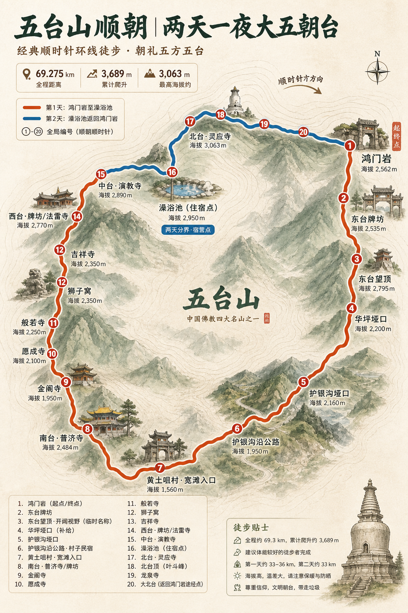
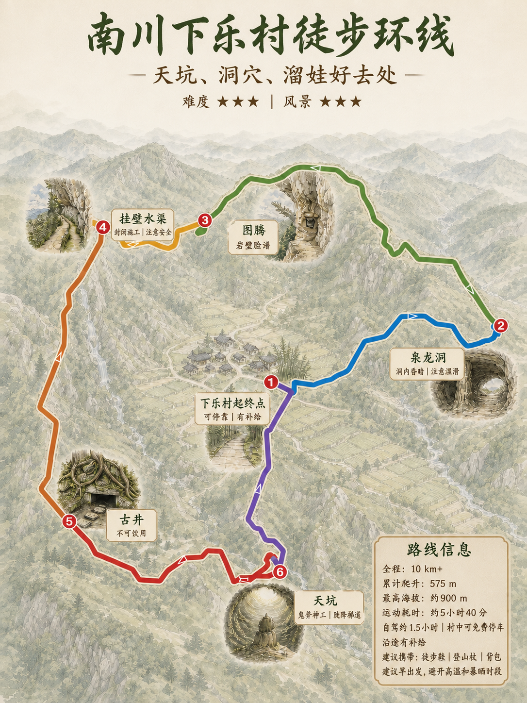

# 轨迹生图 Skill

把 GPX、KML、KMZ 徒步轨迹整理成可核对的路线资料、打卡点方案和独立生图提示词，支持单日路线与多日徒步。

仓库名：`trail-image-generation-skill`

## 它解决什么问题

普通的“把轨迹画成地图”容易出现路线变形、打卡点顺序错乱、地标名称臆测、照片与点位错配等问题。本 Skill 采用“先核对、后创作”的流程：

1. 保留原始轨迹和照片，不改写源文件。
2. 提取距离、爬升、海拔、时长、照片和路线结构。
3. 生成确定性的 SVG 路线骨架和候选打卡点。
4. 对多日徒步额外确认每日分段、跨夜节点、补给和住宿状态。
5. 让用户确认点位名称、顺序、主照片和标志性特征。
6. 确认画面风格、数量、每张图片的完整文字和轨迹精度；轨迹精度默认严格遵循真实轨迹。
7. 逐张生成完整、可直接调用的提示词，并由用户确认后才允许生图。

路线 SVG、PNG 预览、布局 JSON 和编号标注点是强制产物。生图时必须把 PNG 作为最高优先级 `route_geometry` 参考；SVG 和布局 JSON 用于生成前后校验，不使用 SVG 后期确定性叠加修正错误轨迹。默认不自动生成示意等高线。

## 目录

```text
references/   核对模板、路线 SVG 和提示词规则
scripts/      KMZ 检查、路线几何、PNG 预览和生成执行清单校验工具
tests/        Python 单元测试
examples/     单日与多日案例
SKILL.md      可供 Codex/兼容 Agent 使用的技能说明
```

## 快速开始

```bash
python3 scripts/inspect_kmz.py route.kmz --output-dir route-work
python3 scripts/route_to_svg.py route.kmz --output-dir route-work --width 900 --height 1200
python3 scripts/render_route_preview.py route-work/route-轨迹布局.json --output route-work/route-轨迹预览.png
python3 scripts/detect_checkpoint_candidates.py route.kmz --output route-work/checkpoints.json
python3 scripts/route_intensity.py route.kmz
```

路段详图可从同一布局按真实累计进度生成参考图：

```bash
python3 scripts/render_route_preview.py route-work/route-轨迹布局.json \
  --progress-start 0.66 --progress-end 1.0 \
  --output route-work/route-南段参考.png
```

## 图像提供方配置

默认模型为 `gpt-image-2`。默认优先使用当前会话可用的内置生图工具；如需连接自己的中转站，复制 `assets/provider-config.example.json` 到本地私有配置目录，填写地址和环境变量名称，再运行：

```bash
python3 scripts/provider_config.py validate ~/.config/trail-image-generation/providers.json
python3 scripts/provider_config.py show ~/.config/trail-image-generation/providers.json --provider my-relay
```

密钥只通过环境变量传入，不能写入配置文件或提交到 GitHub。中转站调用前必须由用户确认目标地址、模型和上传素材。

然后参考 `references/review-template.md` 创建 `<路线名>-路线核对.md`。确认短语为：

> 打卡点和标志性图片确认无误

只有在用户确认后，才进入提示词编写；完整提示词还需要单独确认后才能图片生成。

图片计划阶段必须先确认：画面风格、生图数量、每张图片的全部文字和轨迹精度。生图数量默认 1 张，轨迹精度默认“精确轨迹/严格遵循轨迹”。

每张最终提示词必须独立完整，包含几何锁定区、文字锁定区、参考图角色、负面约束和验收清单。不得用“同上”“参考前文”或共享计划代替实际内容。完整正文展示后，用户必须回复：

> 生图提示词确认无误

之后才能选择图像提供方和开始生图。正式调用前可生成并校验执行清单：

```bash
python3 scripts/build_generation_manifest.py \
  --task-id route-overview \
  --prompt-file route-work/route-overview-prompt.md \
  --route-png route-work/route-轨迹预览.png \
  --route-svg route-work/route-轨迹骨架.svg \
  --layout-json route-work/route-轨迹布局.json \
  --output route-work/route-overview-manifest.json

python3 scripts/validate_generation_manifest.py route-work/route-overview-manifest.json
```

## 案例

- [武功山单日反穿：高山草甸线](examples/wugongshan.md)
- [五台山顺朝：两天一夜大五朝台](examples/wutaishan.md)
- [南川下乐村：照片预筛选与路线强度](examples/nanchuan-xiale.md)

## 效果图预览

### 五台山顺朝



> 五台山 AI 图用于风格和构图预览；旧案例不代表当前严格轨迹和完整提示词门禁。武功山案例目前只有提示词骨架，待有实际生图结果后再补图。

### 南川下乐村



案例只保留结构和提示词片段，不上传原始照片与轨迹包；使用时替换为自己的 GPX/KML/KMZ 和图片。

## 设计原则

- 事实、用户确认内容、创意假设分开记录。
- 不根据几何形状擅自命名景点。
- 全程使用全局打卡点编号，不在分段图中重新编号。
- 参考截图只提供轨迹几何，不复制底图、文字、图钉或手机界面。
- 有人脸、车牌等隐私信息时，先获得授权或脱敏。
- 没有图像生成能力时只交付提示词，不声称已生成图片。
- 多日徒步使用全局编号和每日分段双重索引，跨夜节点在总览图和日详图中保持同名同号。
- 每天的距离、爬升、补给、住宿和风险提示独立记录，不能用全程统计替代。
- SVG、PNG 预览和标注点属于硬性验收项：缺失时退回路线核对阶段。
- 轨迹、方向、起终点、分段和编号锚点属于 P0；文字、地标、背景和装饰属于 P1，冲突时 P1 必须避让。
- 近距离编号在 SVG 和 PNG 中自动避让，但真实锚点不移动，并通过引线保持对应关系。
- 模型返回成功不等于验收通过；轨迹漂移或点位错位的输出不得标记为正式版本。

## 测试

```bash
python3 -m unittest discover -s tests -v
```

## License

MIT License，见 [LICENSE](LICENSE)。
