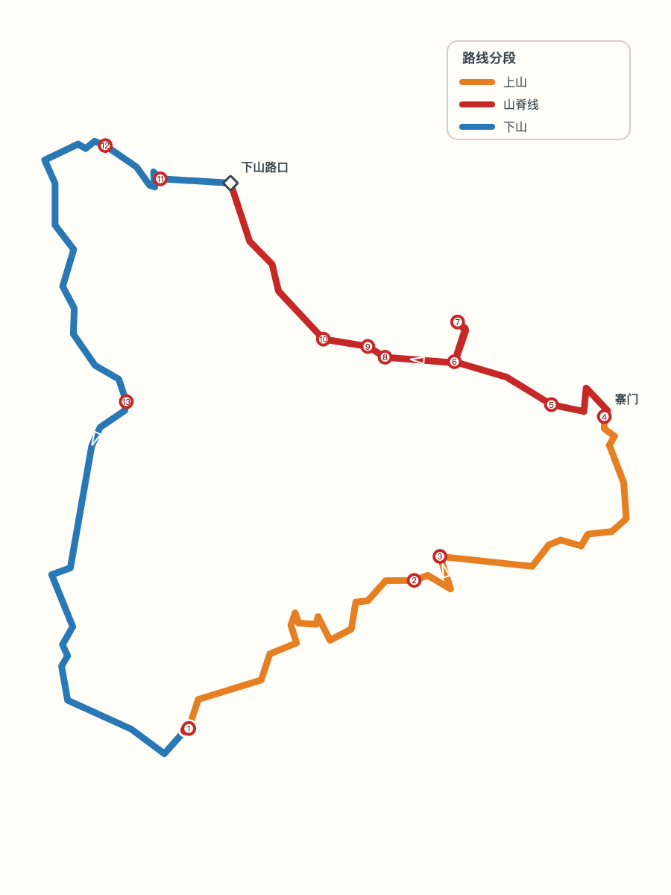
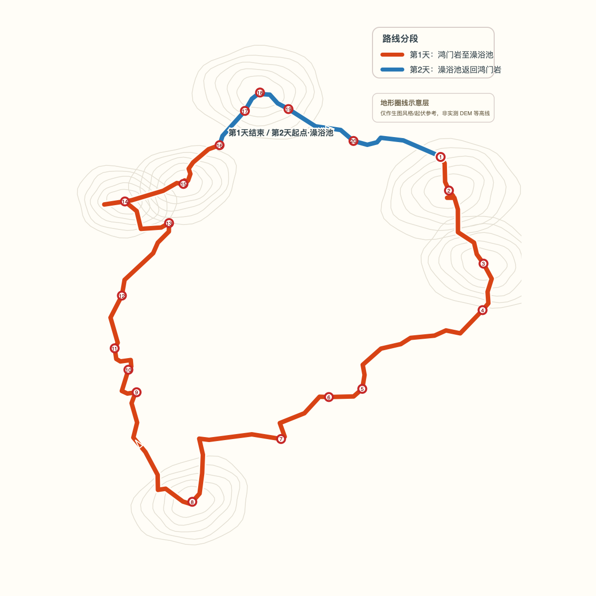

# 轨迹生图 Skill

把 GPX、KML、KMZ 徒步轨迹整理成可核对的路线资料、打卡点方案和独立生图提示词，支持单日路线与多日徒步。

仓库名：`trail-image-generation-skill`

## 它解决什么问题

普通的“把轨迹画成地图”容易出现路线变形、打卡点顺序错乱、地标名称臆测、照片与点位错配等问题。本 Skill 采用“先核对、后创作”的流程：

1. 保留原始轨迹和照片，不改写源文件。
2. 提取距离、爬升、海拔、时长、照片和路线结构。
3. 生成确定性的 SVG 路线骨架和候选打卡点。
4. 对多日徒步额外确认每日分段、跨夜节点、补给和住宿状态。
5. 让用户确认点位名称、顺序、主照片和标志性特征。
6. 再生成总览图、每日详图或打卡点场景的提示词。

路线 SVG、SVG 上的编号标注点和等高线/海拔参考层是强制产物。没有 DEM 时允许使用示意等高线，但必须明确其性质；缺少任一层不得进入最终生图。

## 目录

```text
references/   核对模板、路线 SVG 和提示词规则
scripts/      KMZ 检查、候选点检测、路线强度和 SVG 工具
tests/        Python 单元测试
examples/     单日与多日案例
SKILL.md      可供 Codex/兼容 Agent 使用的技能说明
```

## 快速开始

```bash
python3 scripts/inspect_kmz.py route.kmz --output-dir route-work
python3 scripts/route_to_svg.py route.kmz --output-dir route-work --width 900 --height 1200
python3 scripts/detect_checkpoint_candidates.py route.kmz --output route-work/checkpoints.json
python3 scripts/route_intensity.py route.kmz
```

然后参考 `references/review-template.md` 创建 `<路线名>-路线核对.md`。确认短语为：

> 打卡点和标志性图片确认无误

只有在用户确认后，才进入提示词编写或图片生成。

## 案例

- [江津柏林之巅：环线山脊徒步](examples/jiangjin-bailin.md)
- [武功山单日反穿：高山草甸线](examples/wugongshan.md)
- [五台山：待填充的寺庙山脊案例](examples/wutaishan.md)

## 效果图预览

### 江津柏林之巅



### 五台山顺朝




> 五台山 AI 图用于风格和构图预览；中文、编号和路线几何以 SVG 与后期排版层为准。武功山案例目前只有提示词骨架，待有实际生图结果后再补图。

案例只保留结构和提示词片段，不上传原始照片与轨迹包；使用时替换为自己的 GPX/KML/KMZ 和图片。

## 设计原则

- 事实、用户确认内容、创意假设分开记录。
- 不根据几何形状擅自命名景点。
- 全程使用全局打卡点编号，不在分段图中重新编号。
- 参考截图只提供轨迹几何，不复制底图、文字、图钉或手机界面。
- 有人脸、车牌等隐私信息时，先获得授权或脱敏。
- 没有图像生成能力时只交付提示词，不声称已生成图片。
- 多日徒步使用全局编号和每日分段双重索引，跨夜节点在总览图和日详图中保持同名同号。
- 每天的距离、爬升、补给、住宿和风险提示独立记录，不能用全程统计替代。
- 等高线层与 SVG 标注点属于硬性验收项：缺任一项就退回提示词阶段。

## 测试

```bash
python3 -m unittest discover -s tests -v
```

## License

MIT License，见 [LICENSE](LICENSE)。
