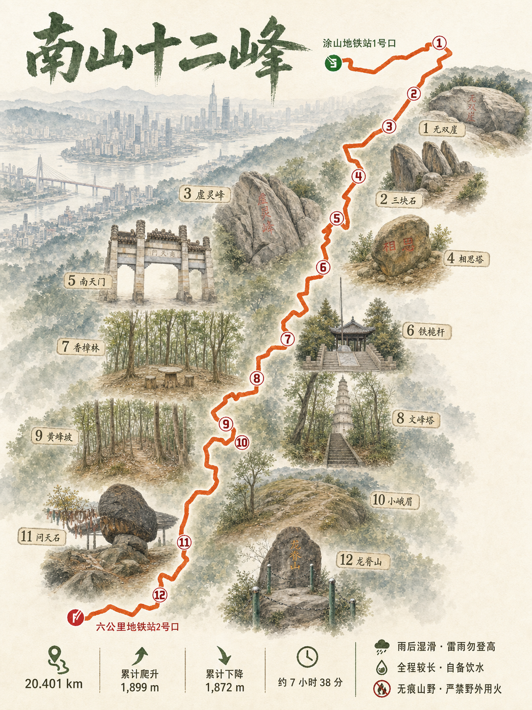
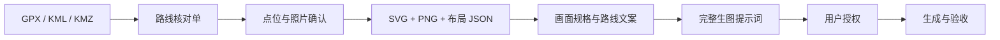

# 轨迹生图 Skill

> 把 GPX、KML、KMZ 轨迹变成可核对、可追溯、可执行的路线图生成方案。

[](LICENSE)
[](requirements.txt)
[](SKILL.md)

`trail-image-generation-skill` 是一个面向徒步、骑行和旅行轨迹的 Agent Skill。它不会拿到轨迹就直接“抽卡式生图”，而是先把路线事实、打卡点、照片、起终点和画面规格整理成可人工核对的资产，再生成完整提示词，并在获得授权后调用图像工具。

它尤其适合路线海报、旅行纪念图、户外攻略图、多日行程总览，以及需要尽量保持真实轨迹形状的 AI 图片任务。



## 为什么需要它

通用生图模型很擅长画“像地图的图”，但经常会改动真实路线：漏掉点位、重复编号、镜像轨迹、移动起终点，或者把照片里的地标和路线锚点对应错。

本项目在生图前建立一条可检查的证据链：



核心不是“保证 AI 像素级复刻轨迹”，而是让事实、几何、提示词、上传素材和最终验收都能被看见、被确认、被追溯。

## 主要能力

- 支持 GPX、KML、KMZ 轨迹，自动提取路线摘要和 KMZ 内嵌照片。
- 生成带起终点、全局编号和真实路线形状的 SVG、PNG 与布局 JSON。
- 先建立唯一的 `<路线名称>-路线核对单.md`，再逐阶段推进提示词和生图。
- 支持单日路线与多日徒步；多日路线保留统一点位编号、每日分段和跨夜节点。
- 可将地标照片逐张简化为统一画风，并生成编号审核板和最终参考板。
- 对图像工具做运行时能力发现；未知模型、尺寸、质量、价格和参考图容量明确记录为 `unknown`。
- 区分 `landmark_prepaint` 与 `route_final` 两类执行器，分别选型、分别授权。
- 最终生图前校验 prompt、轨迹 PNG、参考板和 Provider 能力，避免静默丢素材或切换通道。
- 支持“只生成提示词”模式，不要求必须配置图像 Provider。

## 快速开始

### 1. 安装 Skill

克隆仓库，并软链接到本机 Codex Skills 目录：

```bash
git clone https://github.com/g-dxw/trail-image-generation-skill.git
cd trail-image-generation-skill

mkdir -p ~/.codex/skills
ln -s "$(pwd)" ~/.codex/skills/trail-image-generation-skill
```

如果目标路径已经存在，请先确认它是否是旧版本或已有软链接，不要直接覆盖。

### 2. 安装可选的本地工具依赖

Skill 的路线分析脚本使用 Python；图片参考板和尺寸校验依赖 Pillow：

```bash
python3 -m venv .venv
source .venv/bin/activate
python3 -m pip install -r requirements.txt
```

### 3. 在 Codex 中调用

附上轨迹文件，然后输入：

```text
$trail-image-generation-skill 处理这个轨迹包。
先整理路线基础信息和核对单，不要提前生成提示词或图片。
```

Agent 会先创建路线核对单，并停在第一个确认门；它不会默认调用生图工具。

## 你会得到什么

| 产物 | 用途 |
| --- | --- |
| `<路线名称>-路线核对单.md` | 保存路线事实、用户确认、网络来源、画面规格和阶段状态，是整个任务的唯一事实来源 |
| `<路线名称>-轨迹骨架.svg` | 可编辑、可人工检查的真实路线骨架 |
| `<路线名称>-轨迹预览.png` | 提供给生图模型的最高优先级几何参考 |
| `<路线名称>-轨迹布局.json` | 校验起终点、方向、编号锚点和轨迹进度 |
| 地标简化稿与审核板 | 统一照片画风，核对编号、名称和地标身份 |
| 每张图独立提示词 | 完整记录几何锁定、文字清单、素材映射、负面约束和验收项 |
| generation manifest | 在真正生图前锁定 Provider、能力证据、提示词和实际上传素材 |

## 强制确认流程

Skill 使用明确的确认短语阻止 Agent 跳步：

1. `基础信息确认无误`
2. `打卡点和标志性图片确认无误`
3. `地标简化规格确认无误`（需要 AI 转绘照片时）
4. `地标简化稿确认无误`（需要 AI 转绘照片时）
5. `路线文案与注意事项确认无误`
6. `生图画面规格确认无误`
7. `生图提示词确认无误`
8. 明确选择生成方式并授权

画面规格阶段至少要确认：`画面风格`、`生图数量`、`图中文字`、`轨迹精度`。默认生成数量为 `1 张`，默认采用精确轨迹和干净无连线构图。

完整门禁、跳过条件和执行规则以 [SKILL.md](SKILL.md) 为准。

## 设计原则

### 1. 事实先于画面

原始轨迹、照片、用户确认和可靠来源是事实；AI 地标稿和最终路线图都是表现层。表现层与事实冲突时，以事实为准。

### 2. 几何优先级高于装饰

轨迹、方向、起终点、分段和编号锚点属于 P0；背景、字体、信息卡、地标布局和装饰属于 P1。发生冲突时，P1 必须避让 P0。

### 3. 不猜测模型能力

只有工具 schema、Provider 文档或实际结果能够证明能力。模型名称不能自动证明质量、价格、尺寸或参考图容量。

### 4. 上传最小化

地标预绘每次只上传一张已确认原图。最终路线图最多使用两张视觉参考：

1. 必选：`route_geometry` 轨迹 PNG。
2. 可选：`landmark_reference_board` 地标参考板。

SVG、布局 JSON、原始照片和单张地标稿只用于事实与校验，不进入最终路线图上传清单。

### 5. 授权不可继承

地标小样、批量地标预绘和最终路线图是三个不同授权范围。某一步获得授权，不代表后续步骤可以自动执行。

## 路线工具示例

先检查 KMZ 和候选点位：

```bash
python3 scripts/inspect_kmz.py route.kmz --output-dir route-work

python3 scripts/detect_checkpoint_candidates.py \
  route.kmz \
  --output route-work/checkpoint-candidates.json

python3 scripts/route_intensity.py route.kmz
```

点位经人工确认后，生成几何资产：

```bash
python3 scripts/route_to_svg.py route.kmz \
  --output-dir route-work \
  --checkpoints-json route-work/checkpoints-confirmed.json \
  --width 900 \
  --height 1200

python3 scripts/render_route_preview.py \
  route-work/route-轨迹布局.json \
  --output route-work/route-轨迹预览.png
```

没有 `--checkpoints-json` 的输出只适合早期观察，不能作为最终点位核对资产。

## 图像 Provider（可选）

不配置 Provider 时，可以完成路线核对、几何资产和最终提示词，只是不执行生图。

如需使用外部中转站，复制示例配置到仓库外的私有路径：

```bash
mkdir -p ~/.config/trail-image-generation
cp assets/provider-config.example.json \
  ~/.config/trail-image-generation/providers.json

python3 scripts/provider_config.py validate \
  ~/.config/trail-image-generation/providers.json
```

配置文件只保存环境变量名称，例如 `api_key_env`，不能保存真实 Token。Provider 配置负责描述和选择执行器，不代表仓库已经实现通用网络请求；自定义中转站仍需使用当前环境中已经审查的 adapter，并在上传素材前获得确认。

### 关键校验工具

- `build_image_capability_report.py`：记录当前执行器有证据支持的生成、编辑、尺寸、质量和参考图容量。
- `normalize_landmark_draft.py`：把已生成的地标稿确定性整理为参考板标准稿；模型原始稿的实际像素如实记录，不能用标准稿尺寸替代。
- `validate_stage4_review.py`：检查路线核对单是否完成画面规格、路线文案和阶段确认。
- `validate_landmark_generation_manifest.py`：检查单张地标预绘的输入、输出、哈希和能力证据。
- `validate_generation_manifest.py`：检查终稿提示词、几何资产、参考板、Provider 授权和实际上传清单。

生成 manifest 时必须显式传入 `--capability-report`；能力报告没有证明两图输入时，不能静默省略参考板或假定 Provider 支持。

能力报告、地标 manifest、参考板和最终 generation manifest 的完整命令见：

- [Provider 配置说明](references/provider-config.md)
- [路线几何合同](references/geometry-contract.md)
- [最终提示词规则](references/prompt-rules.md)
- [路线核对单模板](references/review-template.md)

## 案例

### 重庆南山十二峰 · 无连线点位对应

在相同轨迹和 12 个点位下，无连线构图比引导连线更干净，也减少了重复锚点和错误对应。因此 Skill 默认使用相同编号、名称和邻近排版建立关系。

[查看案例说明](examples/nanshan-twelve-peaks.md)


> 案例展示的是工作流和约束方式，不代表生成模型可以实现像素级轨迹复刻。模型返回成功也不等于路线验收通过。

## 项目结构

```text
.
├── SKILL.md               # Agent 强制流程与阶段门禁
├── agents/openai.yaml     # Skill 展示信息与默认调用提示
├── references/            # 核对模板、几何合同、提示词和 Provider 规则
├── scripts/               # 轨迹、能力报告、参考板和 manifest 工具
├── tests/                 # 单元测试与结构校验
├── examples/              # 公开案例和可核对资产
└── assets/                # 不含密钥的配置样例
```

## 开发与验证

```bash
python3 -m unittest discover -s tests -p 'test_*.py' -v

python3 ~/.codex/skills/.system/skill-creator/scripts/quick_validate.py .
```

如果 Pillow 不可用，参考板构建和图片尺寸校验会明确停止，不会生成伪造的替代图片。

## 已知限制

- 生成模型仍可能改变路线形状、文字、编号或地标身份，必须人工验收。
- 本项目不内置“万能 Provider HTTP 客户端”，也不会猜测自定义中转站协议。
- 动态天气、道路施工、景区开放状态等信息会过期，出发前必须再次核实。
- 默认不生成示意等高线；只有提供可靠地形数据并明确要求时才应加入。
- 轨迹文件和照片可能包含精确位置、人脸等隐私信息，上传外部服务前应先检查和脱敏。

## 参与贡献

欢迎提交 Issue 或 Pull Request，尤其是：

- 新的 GPX/KML/KMZ 兼容案例。
- 路线几何、点位完整性和多日分段的边界测试。
- 不绑定特定厂商的 Provider adapter 设计。
- 更稳定的生成结果验收方法。
- 文档、模板和中文户外安全提示改进。

提交前请运行完整测试，并确保示例、日志和配置中不包含 Token、私人照片或精确隐私位置。

## License

本项目基于 [MIT License](LICENSE) 开源。
