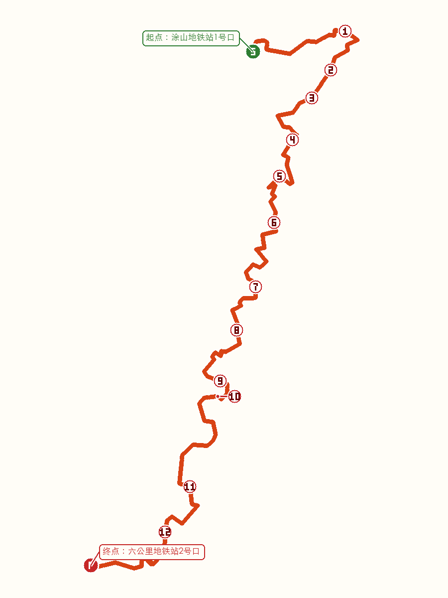

# 案例五：重庆南山十二峰

## 效果图

这是用户在同一套轨迹、点位、地标、文字和背景条件下，对比“无连线”和“有连线”两个版本后确认的优选方案。效果图由模型直接渲染中文；它是一次真实生成结果，不是确定性地图制图输出。

## 输入概况

- 路线类型：重庆南山单日开放式穿越线
- 起点：涂山地铁站1号口
- 终点：六公里地铁站2号口
- 来源应用记录：20.401 km、累计爬升 1,899 m、累计下降 1,872 m、约 7 小时 38 分
- 画面风格：轻写实户外手账水彩，竖版 3:4
- 背景环境：重庆南山远眺渝中区，低对比、空气透视的 P1 远景

## 全局点位

`1 无双崖 → 2 三块石 → 3 虚灵峰 → 4 相思塔 → 5 南天门 → 6 铁桅杆 → 7 香樟林 → 8 文峰塔 → 9 黄蜂坡 → 10 小峨眉 → 11 问天石 → 12 龙脊山`

点位必须同时具备轨迹锚点、正确编号、正确名称和对应地标。地标卡片存在不能替代轨迹锚点；遗漏、重复、增补或跳号均判定为不合格。

## 可核对几何资产

- [带起终点和 1—12 号锚点的 SVG](assets/nanshan-twelve-peaks/route-skeleton.svg)
- PNG 用作最终生图的最高优先级视觉几何参考。
- SVG 用于人工核对和编辑；布局 JSON 仍应由本地流程生成并用于锚点校验。

## 对比实验结论

两个版本都让模型直接渲染相同的标题、起终点、路线数据、12 个点位名称和安全提示，唯一实验变量是地标引导连线。

- 无连线版本：轨迹线上 1—12 完整且无重复，画面更干净，地标通过相同编号、名称和邻近布局对应。
- 有连线版本：模型在终点附近额外重复了 12 号锚点，长连线也增加了视觉干扰。
- 用户最终选择无连线版本，并将其固化为 Skill 默认构图方式。

## 沉淀为通用规则

- 默认不绘制地标卡片到轨迹锚点的引导连线。
- 只有用户明确要求时才允许连线；无法可靠对应时必须取消连线。
- 地域背景只有在用户确认具体环境后才加入，并保持低对比 P1 远景。
- 背景、地标、文字和信息卡必须避让 P0 路线、起终点及全部编号锚点。
- 不把未经确认的具体建筑、城市状态、开放状态或动态信息画成事实。

## 已知限制

本次优选图仍把起点站名渲染出来但缺少“起点：”前缀，因此它适合作为案例效果图，不应被当作零误差的正式导航地图。正式交付仍需逐项验收路线形状、起终点角色、编号数量、文字和地标身份。

为保护素材边界，本公开案例不包含原始现场照片、地标预绘单图、本机绝对路径、Provider 配置或生成执行清单。
